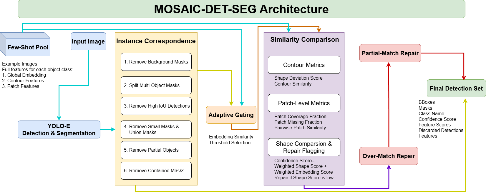
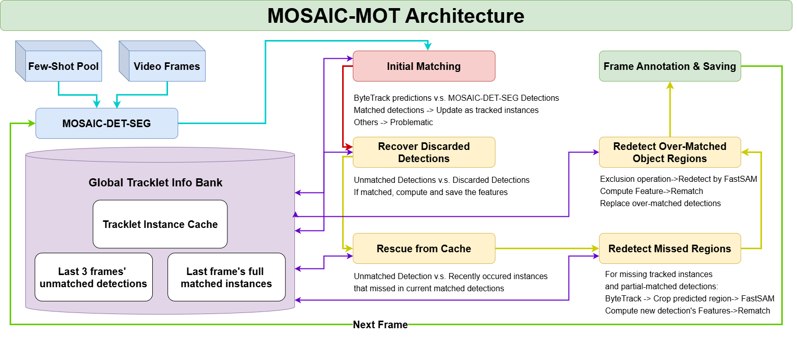

# MOSACI-MOT: Motion‑&‑Object Segmentation with Adaptive Instance Correspondence

## Overview
This project presents MOSAIC-MOT, a robust few-shot multi-object tracking (MOT) system designed to address the challenges of tracking arbitrary objects in complex, real-world environments. Unlike traditional MOT methods, which rely heavily on large-scale training datasets and fixed object categories, MOSAIC-MOT leverages few-shot examples, a small set of annotated images, to recognise and track custom objects without extensive retraining. Built upon a detect-segment-then-track pipeline, the system integrates YOLO-E for initial detection and segmentation, refined through an innovative Instance Correspondence process that resolves ambiguities such as partial, exact, and over-matched detections. This ensures clean, instance-level object recognition across varied object types and scenes.

### MOSAIC Detection and Segmentation Architecture


### MOSAIC Multi-Object Tracking Architecture


The project includes comprehensive experimentation and manual evaluation across diverse scenarios, including retail shelf monitoring, hands-up detection in classrooms, pen tracking, and toy interaction, demonstrating strong generalisation and improved performance over existing zero-shot MOT methods. The system is deployed with CPU-based optimisations and supports an intuitive interface for both detection and tracking, enabling real-time adjustments and user-friendly interaction. MOSAIC-MOT thus offers a significant advancement in few-shot MOT research, providing a scalable, practical solution for custom object tracking in dynamic environments.


## Get Started
### Install the required dependencies:
```bash
pip install -r requirements.txt
```

Get GroundingDINO Repo:
```bash
git clone https://github.com/wenyi5608/GroundingDINO.git -b wenyi5608-openvino
cd GroundingDINO/
pip install -r requirements.txt
pip install openvino openvino-dev onnx onnxruntime
pip install -e .
```

Download Model Weights:
```bash
mkdir weights
cd weights/
wget -q https://github.com/IDEA-Research/GroundingDINO/releases/download/v0.1.0-alpha/groundingdino_swint_ogc.pth
wget -q https://github.com/ultralytics/assets/releases/download/v8.3.0/yolo11l.pt
wget -q https://github.com/ultralytics/assets/releases/download/v8.3.0/yoloe-11l-seg-pf.pt
wget -q https://github.com/ultralytics/assets/releases/download/v8.3.0/FastSAM-s.pt
cd ..
```

## Run MOSAIC-MOT
1. Run the Few-Shot Labeling Interface
```bash
python labeling_interface.py
```

Compile to C executable using Nuitka:
```bash
nuitka labeling_interface.py --standalone --enable-plugin=tk-inter --enable-plugin=numpy --enable-plugin=torch --include-package=ultralytics --include-package=torch --include-package=torchvision --include-package=PIL --include-package=lap --include-package=cv2 --include-package=numpy  --include-data-files=.\\venv\\Lib\\site-packages\\ultralytics\\**\\*.yaml=ultralytics/ --include-data-dir=annotations=annotations --output-dir=build --nofollow-import-to=tkinter.test
```

Then, manually move all the files under `.\\venv\\Lib\\site-packages\\ultralytics\\cfg` to `.\\build\\labeling_interface.dist\\ultralytics\\cfg`

2. To run the MOSAIC Interface (GUI for detection and tracking):
```bash
python mosaic_interface.py
```

Compile to C executable using Nuitka:
```bash
nuitka mosaic_interface.py --standalone --enable-plugin=tk-inter --enable-plugin=numpy --enable-plugin=torch --include-package=ultralytics --include-package=torch --include-package=torchvision --include-package=PIL --include-package=cv2 --include-package=numpy --include-package=requests --include-package=pathlib --include-package=threading --include-package=multiprocessing --include-package=mosaic_det_seg --include-package=mosaic_mot --include-data-files=.\\venv\\Lib\\site-packages\\ultralytics\\**\\*.yaml=ultralytics/ --include-data-files=bytetrack.yaml=./ --include-data-dir=weights=weights --output-dir=build --nofollow-import-to=tkinter.test
```

Then, manually move all the files under `.\\venv\\Lib\\site-packages\\ultralytics\\cfg` to `.\\build\\mosaic_interface.dist\\ultralytics\\cfg`

3. To run the Few-Shot Feature Processor:
```bash
python few_shot_features.py
```

4. To run the tracking system on a video:
```bash
python mosaic_mot.py
```

5. To run the detection and segmentation system on an image:
```bash
python mosaic_det_seg.py
```

6. To Optimise models via OpenVINO:
```bash
python openvino_inference.py
```
